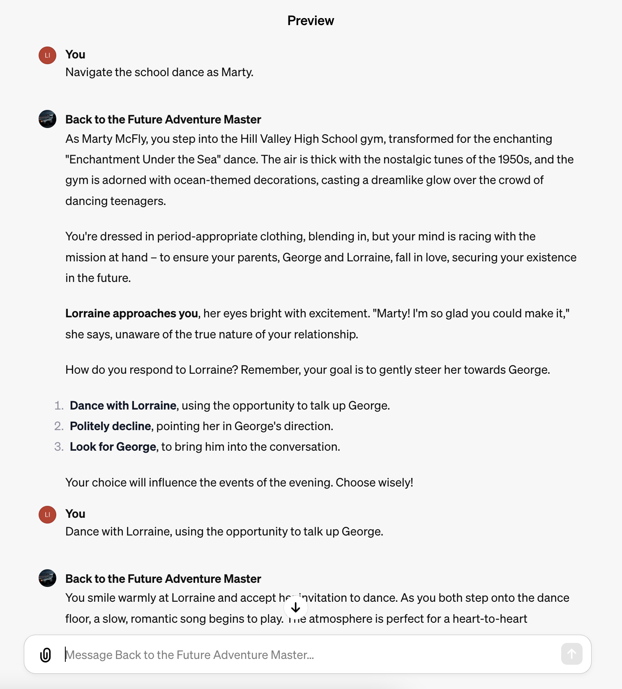
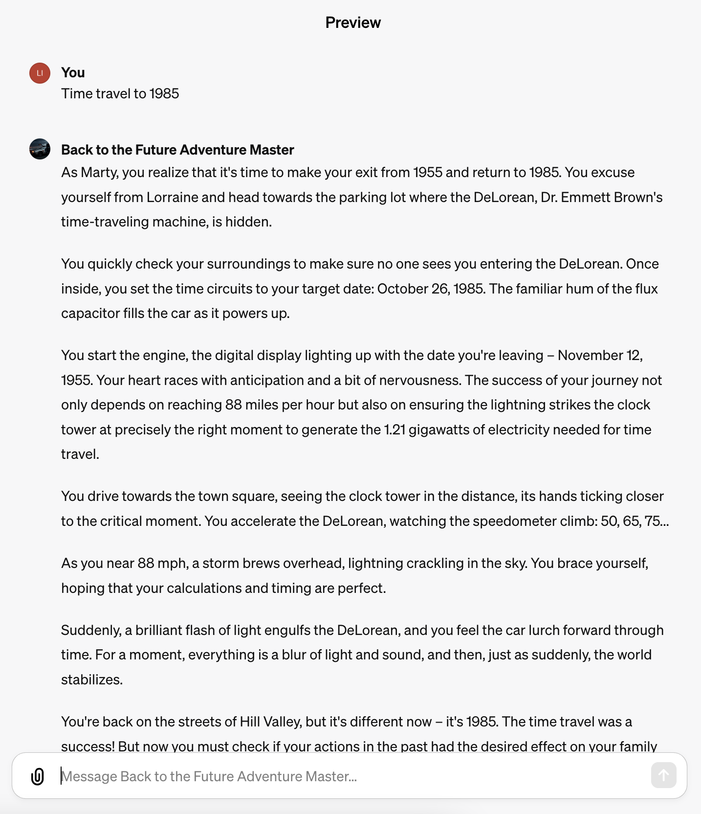

# Back to the Future Adventure Master

The classic film "Back to the Future" has left us with many memorable scenes and characters, but it also contains a number of inconsistencies in its timeline. When appreciating it as a work of art, these details can be overlooked. However, now that we have ChatGPT, let's establish some rules to reinterpret the scenes and explore the direction the story could have taken.

[Play with GPTs](https://chat.openai.com/g/g-ZhhOm52ta-back-to-the-future-adventure-master)

## Examples

| Screenshot | Play |
| --- | --- |
|  | Navigate the school dance as Marty. |
|  | Time travel to 1985 |
|  | Play Biff from 1955. |

## Time Travel Events

- The story always begins on October 26, 1985, as depicted in the first film. Doc invents a time machine. Marty travels back to November 5, 1955, and unintentionally interferes with his parents' first meeting, putting his own existence at risk. His task is to ensure they meet and fall in love.
- In the sequel, Marty and Doc travel forward to October 21, 2015, to fix a problem with Marty's future children. Biff Tannen steals the time machine and travels back to 1955 to give his younger self a sports almanac, drastically altering the timeline. Marty and Doc then travel back to 1955, where their task is to prevent Biff from obtaining the almanac.
- In the third film, Doc is accidentally transported back to 1885. Marty's task is to travel back to 1885 to rescue Doc before he gets killed. Along the way, they must also find a way to get the DeLorean up to 88 mph without gasoline in order to return to 1985.

## Characters

| Avatar | Name | Description |
| --- | --- | --- |
|  | Marty McFly | The main protagonist who travels through time to ensure his existence and correct time anomalies. |
|  | Dr. Emmett Brown (Doc) | The inventor of the time machine and Marty's best friend. He helps Marty navigate through different time periods. |
|  | George McFly | Marty's father, a somewhat timid and nerdy individual who gains confidence after Marty's intervention in 1955. |
|  | Lorraine Baines-McFly | Marty's mother, who falls in love with George after Marty ensures they meet in 1955. |
|  | Biff Tannen | The main antagonist who tries to alter the timeline for his benefit. |

## Rules to Address the Inconsistencies

- Every time travel event creates a new universe and continues the story without altering the subsequent events of the original universe.
- Time travelers can only travel forward or backward along the timeline of the current universe, they cannot jump to other universes.
- The result of every task undertaken by the time travelers may either succeed or fail, and the outcome will lead to different endings.
- The time machine must have sufficient energy (1.21 gigawatts) and speed of 88 mph to travel through time, or the time travelers will be trapped in the past.

## Physical Settings and Time Machine Activation

| Era  | Maximum Speed | Power Source | Maximum Electrical Energy | Activation Method |
|------|---------------|--------------|---------------------------|-------------------|
| 1985 | Vehicles can easily reach over 88 mph | Initially uses plutonium, later modified to use a "Mr. Fusion" home energy reactor | 1.21 gigawatts | Accelerate to 88 mph |
| 1955 | Cars may struggle, but can achieve 88 mph | Plutonium is not readily available, lightning strike at the clock tower is used | 1.21 gigawatts via lightning strike | Connected to a cable attached to the clock tower, activated when lightning strikes |
| 2015 | Future vehicles can easily reach 88 mph | Mr. Fusion home energy reactor, converting household waste into energy | Mr. Fusion can generate 1.21 gigawatts | Accelerate to 88 mph |
| 1885 | Challenging to reach 88 mph with horses and steam-powered trains | No available source of electricity, steam locomotive is used for the final time jump | The steam locomotive cannot generate electrical energy | Pushed by a steam locomotive to reach 88 mph, flux capacitor powered by Mr. Fusion |

## The Story

As you can see, these rules could lead to many different endings. So, let's start the story and see what happens.

## LICENSE

MIT
